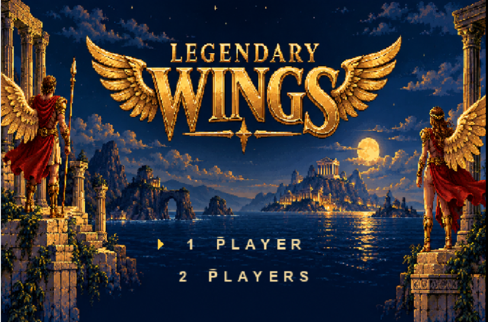

# Legendary Wings NES to PC

  

A native Windows port of **Legendary Wings** with refreshed artwork and faithful gameplay. Switch between the original graphics and the remastered presentation while playing.

**Author:** dmb062082  
**Website:** [Retro Replay](https://retro-replay.com)  
**Status:** Work in progress — the remaster currently focuses on the first level.

[Releases](https://github.com/retroreplay82/Legendary-Wings-NES-to-PC/releases) · [Report a bug](https://github.com/retroreplay82/Legendary-Wings-NES-to-PC/issues/new/choose) · [Request a feature](https://github.com/retroreplay82/Legendary-Wings-NES-to-PC/issues/new/choose)

## What is included

- Refreshed first-level environments, characters, and title-screen artwork.
- **F6** switches between original and remastered graphics without restarting your game.
- Optional animated water, toggled with **F5**; it starts **off**.
- Save and load states with **F8** and **F9**.
- A Windows game window that launches without a console window behind it.

## Work in progress

This is an early beta project. Really only the first level has received the main remaster work so far. Later levels may still use original graphics, and some first-level details are still being refined. Future updates will improve the artwork and transitions, expand the remaster to later levels, and address reported bugs.

No downloadable Windows release has been published yet. When a package is ready, it will appear on the [Releases page](https://github.com/retroreplay82/Legendary-Wings-NES-to-PC/releases). The repository's **Code → Download ZIP** option is not a playable Windows release.

## Getting started

When a Windows release is available:

1. Download its Windows ZIP from the Releases page and extract it into its own folder.
2. Place your compatible **Legendary Wings (USA).nes** file in the **roms** folder beside **LegendaryWings.exe**.
3. Launch **LegendaryWings.exe**. Keep **SDL2.dll** and the **assets** folder beside it.

You must supply your own compatible ROM. **No ROM files or extracted ROM assets are included in the public distribution.** Do not upload ROMs to this repository or attach them to issues.

## Keyboard controls

| Key | Action |
| --- | --- |
| Arrow keys | Move |
| X | Fire |
| Z | Bomb / jump, depending on the section |
| Enter | Start / pause |
| Backslash (`\`) | Select |
| **F5** | Toggle water animation on / off — starts off |
| **F6** | Switch between original and remastered graphics |
| **F8** | Save state |
| **F9** | Load the saved state |
| F11 | Toggle fullscreen |
| F12 | Take a screenshot |

F6 changes only the presentation and keeps your current gameplay progress. Remastered artwork appears where it has been completed.

Save states use one slot per ROM in the **saves** folder beside the executable. Saving again replaces the previous state. Loading replaces your current progress with the saved point. Back up your saves before updating; compatibility between builds is not guaranteed.

## Quiver Launcher

Support for [Quiver Launcher](https://quiverlauncher.com/) is planned. A compatible release and catalog will be published after download and installation have been verified. This is not currently a verified Quiver install.

## Feedback

Use [GitHub Issues](https://github.com/retroreplay82/Legendary-Wings-NES-to-PC/issues/new/choose) to report bugs or suggest improvements. Include the build version, the level or section, whether you were using original or remastered graphics, and the steps needed to reproduce the problem. Screenshots are helpful. Please keep ROM files and private information out of reports.

See [CONTRIBUTING.md](CONTRIBUTING.md) for more details.

## Disclaimer

This is an unofficial fan-made/open-source project. It is not affiliated with, endorsed by, sponsored by, or approved by Capcom or Nintendo. Capcom, Legendary Wings, and related names, characters, music, artwork, and assets are trademarks and/or copyrights of Capcom. No Nintendo-owned game assets are included in this repository. You must provide your own legally obtained ROM.

This project was intended to be a faithful recreation or port first, and a mod second. If you are unhappy with the changes or the progress so far, press **F6** to switch to the original graphics and play with the original presentation.

I will update the project when I can. So far, the first level is complete enough to satisfy me, although there is still room for improvement. Please report any bugs through [GitHub Issues](https://github.com/retroreplay82/Legendary-Wings-NES-to-PC/issues/new/choose), and we can make it better together.

## Credits and licensing

Modded by **retro-replay.com**. Project author: **dmb062082**.

Built with [NESRecomp](https://github.com/mstan/nesrecomp) and [SDL2](https://www.libsdl.org/). Their license notices must accompany the corresponding components in a distribution. This repository does not grant a license to the original game's ROM or assets; the original game and its intellectual property belong to their respective owners.
